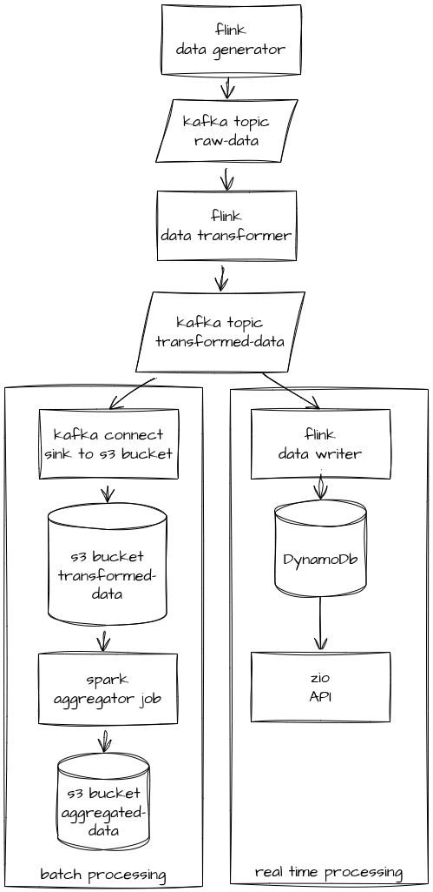

# Pipeline example
This project is showing a data pipeline example running locally. It contains real-time and batch data processing pipelines and uses common data engineering tools.

## Data workflow

- All starts with Flink application, which generates dummy data of a person with name and age. It pushes data to a kafka topic.
- Another Flink application reads raw data, transforms it and pushes to another topic. For simplicity, it is just adding a field isAdult.
- Real time (flink) and batch (kafka connect) parts consume transformed data from the topic.
  - Real time part: 
    - Another Flink application writes consumed data to DynamoDb. DynamoDb table contains uniq person names with their count and avg_age.
    - ZIO API is available at the endpoint http://localhost:58080, and one can read user info from a database through it.
  - Batch part:
    - Kafka-connect sinks consumed data to s3 bucket.
    - spark application running periodically aggregates data and writes it back to s3.

## Run
Just run
```bash
  make up
```
docker compose will spin up all necessary local services:
- kafka with raw-data & transformed-data topics
- kafka-connect with added s3 sink
- minio (s3) with raw-data & transformed-data buckets
- dynamodb with a table PersonTable

also it starts real-time applications:
- flink generator
- flink transformer
- flink writer
- API

To periodically run a spark application, as well:
```bash
  up-and-run-spark
```

To check data in kafka topics:
```bash
kcat -b localhost:9092 -t raw-data
```
```bash
kcat -b localhost:9092 -t transformed-data
```

To query DynamoDB data through the api one can run (Alice is an example name, right now we write just 10 different names):
```bash
  curl http://localhost:58080/person/?name=Alice
```

To check s3 files:
```bash
aws --endpoint-url http://localhost:9000 s3 ls aggregated-data  --profile minio --recursive
```

docker compose has some parameters that can control the workflow, e.g. new person generator rate.

## Possible improvements
- add tests for flink and api
- add github actions
- try more complex data or real one instead of dummy person
- run some parts in minikube + airflow instead of having everything in docker compose
- add a simple model that can be trained on aggregated data and work in the API in real time
